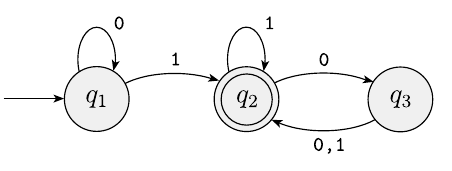

# Finite Automata Simulator

A finite automata simulator that checks if a language is accepted or rejected

## Theory

Finite automata is a mathematical model used to understand and study computers with an limited amount of memory. Their representation is called state diagram, where:

* The states are the circles
* The input start is indicated by the arrow pointing it from anywhere ($q_1$)
* Double circles indicates an accetable state ($q_2$)
* A arrow pointing from a state to another is called transition

<p align="center">
    
</p>

Check this link for the course about theory of computation: [MIT Theory of Computation Course](https://www.youtube.com/playlist?list=PLUl4u3cNGP60_JNv2MmK3wkOt9syvfQWY)

### How to use

The program is simple. You can create your own finite automata. When you run it, the program will keep asking you for new inputs, and it will checks if the input language is accepted or rejected.

### Prerequisites

```bash

# Cloning the repository
$ git clone FINITE-AUTOMATA

# Go to the folder 
$ cd FINITE-AUTOMATA

# Run
$ python3 main.py

```

### Tecnologias

* [Python](www.python.org)

### License

MIT License

Copyright (c) 2022 Luis Henrique

Permission is hereby granted, free of charge, to any person obtaining a copy
of this software and associated documentation files (the "Software"), to deal
in the Software without restriction, including without limitation the rights
to use, copy, modify, merge, publish, distribute, sublicense, and/or sell
copies of the Software, and to permit persons to whom the Software is
furnished to do so, subject to the following conditions:

The above copyright notice and this permission notice shall be included in all
copies or substantial portions of the Software.

THE SOFTWARE IS PROVIDED "AS IS", WITHOUT WARRANTY OF ANY KIND, EXPRESS OR
IMPLIED, INCLUDING BUT NOT LIMITED TO THE WARRANTIES OF MERCHANTABILITY,
FITNESS FOR A PARTICULAR PURPOSE AND NONINFRINGEMENT. IN NO EVENT SHALL THE
AUTHORS OR COPYRIGHT HOLDERS BE LIABLE FOR ANY CLAIM, DAMAGES OR OTHER
LIABILITY, WHETHER IN AN ACTION OF CONTRACT, TORT OR OTHERWISE, ARISING FROM,
OUT OF OR IN CONNECTION WITH THE SOFTWARE OR THE USE OR OTHER DEALINGS IN THE
SOFTWARE.
